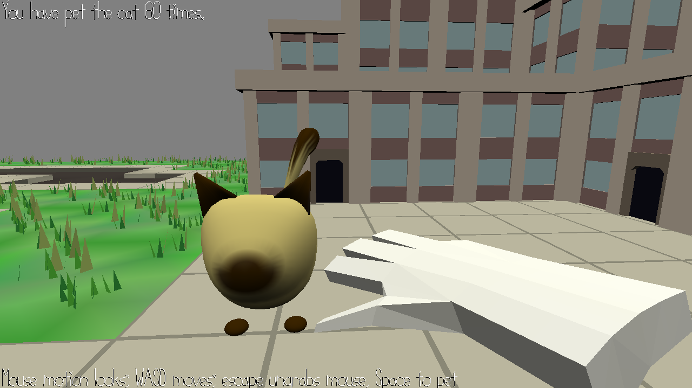

# Stray Cat Petting Simulator

Author: Anne He

Design: A game about petting cats in a serene postapocalyptic ghost town.

You spot a stray cat on the street and feel the primal urge to pet it. Unfortunately, if you pet it too many times in one spot it runs away from you. Chase the cat through the city and try to pet it as many times as possible.

Screen Shot:

How To Play:

Mouse to look around, WASD to move, ESC to ungrab mouse, space to pet. It will make a sound if you are in petting range.
Pet the cat 10 times and it will turn into thin air and rematerialize somewhere else on the map. As cats do.

The gameplay is fairly simple and the game is more about wandering around the environment and experiencing the atmosphere. 
At first I wanted the cat to traverse along the walkmesh as well so the player could chase after it, but I realized it mostly took the same path every time due to the geometry of the mesh, and I didn't have enough time to debug it to be playable.

The song I used as background music is really long so it takes a while to load in. The game is probably not crashing on startup.

Cat sometimes spawns into buildings or off the side of the map because I didn't account for the inherent size of the cat,
but it should still be in a reachable range. There is currently some debug code in update that prints out your location and the cat's location if you are having a hard time finding it.
The randomized spawn distance is capped at not-too-far from where it was last.

Sources: Used 15-466 Game 5 base code and code from in-class/in-Discord discussions, with slight modifications and comments. 
Thanks Owen, Shane, and Ben for your Discord contributions! Also referenced code from F20 on simplifying barycentric velocity with the helper function.

Modified included city scene originally by Jim McCann.

Reused cat assets and code from Game 2 with permission from collaborator George Ralph: https://github.com/gdr22/15-466-f21-base2. 
Perhaps this game takes place in the same universe.

"Ancient Winds" by Kevin MacLeod, from freepd.com, under CC0.
"Walking sound" (originally titled A Walk with Stop) by straget, from https://freesound.org/people/straget/sounds/414921/. CC0.
"Pet" (originally titled Petting an Animal) by AryaNotStark, from https://freesound.org/people/AryaNotStark/sounds/407626/. CC0.

Sounds modified in Audacity to make them work better as sound effects in game.

This game was built with [NEST](NEST.md).

